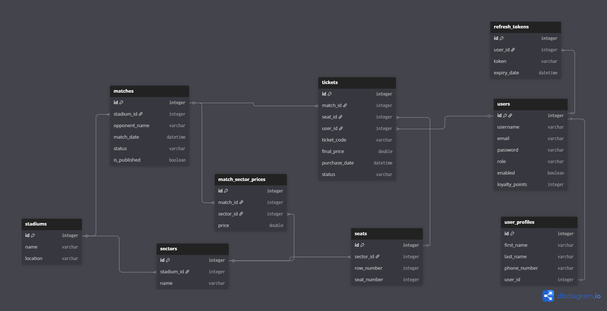
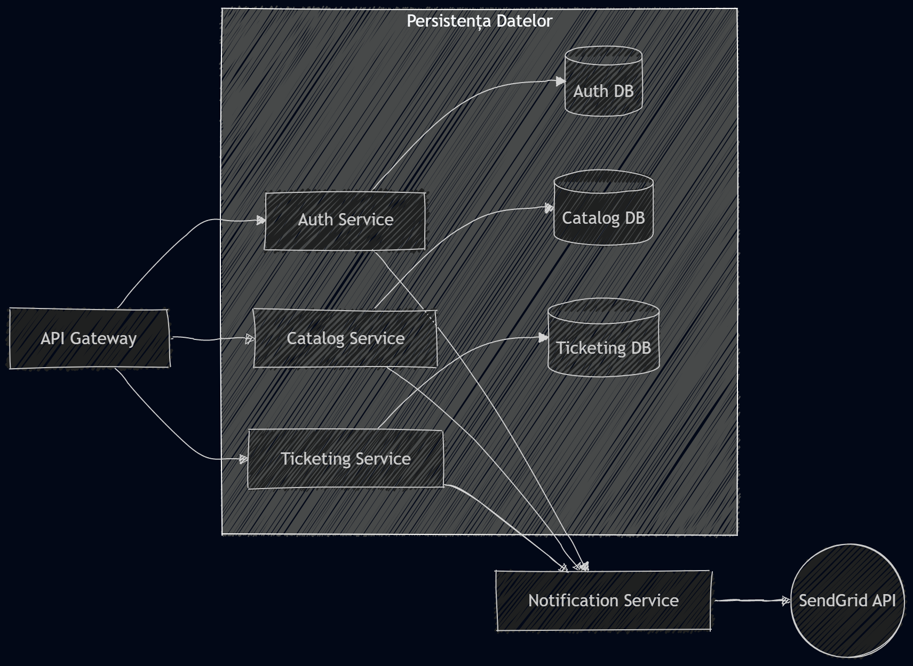
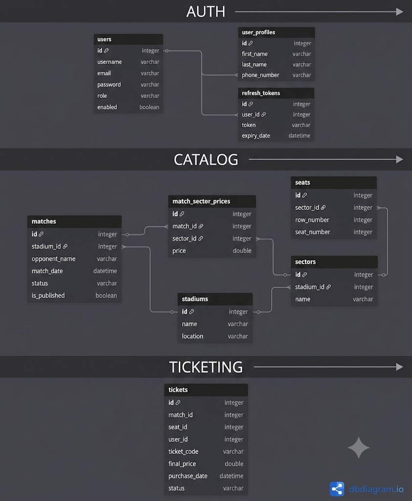
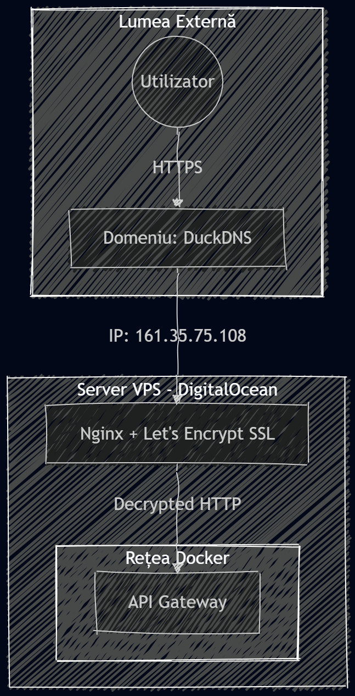
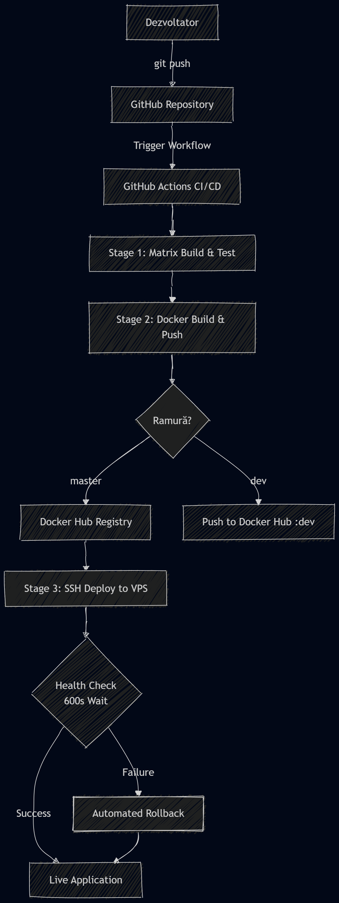

# 🏟️ Arena Ticketing Platform

Link: https://arena-ticketing.duckdns.org/

## Introducere

Acest proiect reprezintă evoluția unei aplicații de ticketing pentru evenimente sportive, inițiată în semestrul anterior. Dacă varianta inițială a fost concepută ca un monolit robust în Spring Boot, actuala iterație transformă acest MVP într-un sistem distribuit bazat pe microservicii, mai stabil și pregătit pentru un mediu de producție real.

Scopul principal este oferirea unei platforme digitale moderne care permite suporterilor achiziționarea rapidă și sigură a biletelor, gestionând totodată fluxul de notificări și administrarea meciurilor.

- 🔗 Repository inițial (Monolit): https://github.com/CaruntuRazvan/Arena-ticketing-backend

---

## Evoluția Arhitecturii

## 1. Arhitectura Inițială

În prima versiune, toate modulele (Autentificare, Catalog, Ticketing) erau integrate într-o singură aplicație Spring Boot, comunicând intern prin apeluri de metodă și partajând aceeași bază de date.

Mai jos este prezentată diagrama bazei de date (ERD) pentru versiunea monolit, unde integritatea referențială era gestionată strict prin relații SQL între toate entitățile sistemului:




## 2. Evoluția Arhitecturală: Tranziția către Microservicii

După finalizarea versiunii inițiale (monolit), a fost identificată necesitatea unei arhitecturi mai robuste, capabile să susțină scalabilitate crescută și mentenanță simplificată. Astfel, backend-ul a fost refactorizat într-un ecosistem distribuit format din următoarele microservicii independente:

- **Auth Service**: Gestionează stocarea utilizatorilor, verificarea credențialelor și emiterea token-urilor JWT (JSON Web Tokens).
- **Catalog Service**: Gestionează entitățile de business, precum meciurile, echipele și inventarul locurilor disponibile.
- **Ticketing Service**: Componenta tranzacțională principală; procesează achizițiile de bilete și gestionează istoricul rezervărilor.
- **Notification Service**: Serviciu dedicat comunicării cu utilizatorii (e-mail prin SendGrid), proiectat să decupleze procesele de notificare de fluxul critic de vânzare a biletelor sau de catalogul de meciuri.




**Separarea bazelor de date pe microservicii:**



---

**Structura Internă a Microserviciilor**

Fiecare microserviciu (Auth, Catalog, Ticketing, Notification) este construit folosind Spring Boot Web și urmează o arhitectură pe straturi (layered architecture), asigurând separarea clară a responsabilităților și o mentenanță ușoară.

- **Controller Layer**: Expune endpoint-urile REST API și gestionează request-urile primite de la client.

- **Service Layer**: Conține logica principală de business; aici se realizează validările, calculele și orchestrarea operațiilor.

- **Repository Layer**: Interacționează direct cu baza de date prin Spring Data JPA, gestionând operațiile CRUD.

- **DTO (Data Transfer Object)**: Definește structuri de date utilizate pentru comunicarea cu clientul, izolând entitățile interne de baza de date de API-ul public.

- **Client Layer**: Include interfețe Feign utilizate pentru comunicarea între microservicii.

- **Exception Handling**: Strat global de gestionare a erorilor care asigură răspunsuri HTTP standardizate (ex: 400, 404, 500) în cazul apariției unor excepții.

---

**Frontend: Arena Ticketing Dashboard**

Frontend-ul aplicației este dezvoltat în **React** și stilizat cu **Tailwind CSS**, oferind o interfață modernă pentru interacțiunea cu sistemul de microservicii. Toate request-urile sunt realizate prin intermediul **API Gateway-ului**, asigurând un punct unic de comunicare cu backend-ul.

Aplicația include autentificare bazată pe **JWT**, cu interfețe adaptate în funcție de rolul utilizatorului:

- **User Interface**: vizualizare meciuri, selectare locuri și achiziție bilete.
- **Admin Interface**: administrare meciuri, stadioane și monitorizare vânzări.


Codul este organizat modular pentru scalabilitate și mentenanță ușoară:

- **api/**: configurare Axios pentru comunicarea cu API Gateway
- **components/**: componente UI reutilizabile
- **context/**: management stare globală (Auth / sesiune utilizator)
- **pages/**: pagini principale ale aplicației
- **services/**: logică de procesare a datelor din backend
- **App.jsx**: routing principal și rute protejate în funcție de rol

---
## 🤖 Inteligență Artificială (AI-Powered Insights)

În cadrul modulului `catalog-service`, am integrat capabilități de Inteligență Artificială pentru a îmbunătăți experiența utilizatorului prin generarea de informații contextuale despre meciuri.


### ⚙️ Implementare tehnică

- **Tehnologie**: Spring AI pentru integrarea cu modele de limbaj (LLMs)
- **Endpoint**: `/api/catalog/matches/{id}/ai-trivia`
- **Funcționalitate**: generează automat curiozități (trivia) despre echipa adversă


### Prompt Engineering

Pentru a controla calitatea răspunsurilor generate, promptul a fost definit cu reguli stricte:

- răspunsuri scurte (maxim 15 cuvinte per informație)
- format tip listă (bullet points)
- limbă: română
- focus pe informații relevante și ușor de citit


### Optimizare și performanță

- **Caching (@Cacheable)**: rezultatele AI sunt cache-uite pe baza numelui adversarului pentru a evita apeluri repetate costisitoare
- **Reducerea costurilor**: elimină apelurile redundante către modelul AI


---

## Strategia de Testare

Pentru a asigura stabilitatea sistemului, am implementat o strategie de testare pe două niveluri: testare unitară și testare de integrare.


**1. Unit Testing**

Fiecare microserviciu este acoperit cu teste unitare folosind **JUnit 5** și **Mockito**.

- validarea logicii de business din Service Layer în mod izolat
- mock pentru repository-uri și dependențe externe
- acoperirea scenariilor principale și a gestionării excepțiilor
- verificare prin code coverage pentru ramurile critice ale aplicației

**2. Integration Testing**

Pentru validarea fluxurilor între servicii, am implementat teste de integrare folosind **WireMock** și mocking al dependențelor.

- simularea microserviciilor externe (Auth, Catalog) cu WireMock
- testarea fluxului complet de achiziție bilet (end-to-end logic)
- izolarea bazei de date prin Mockito pentru Repository Layer


---

**Observabilitate și Logare**

Pentru monitorizare și debugging eficient, am implementat un mecanism de logare centralizat folosind **Spring AOP (Aspect-Oriented Programming)**.

Un `LoggingAspect` interceptează automat apelurile din Service Layer pentru fiecare microserviciu, oferind:

- **Trasabilitate**: logare automată pentru începutul (START), finalul (END) și erorile (ERROR) fiecărei operații
- **Monitorizare performanță**: măsurarea timpului de execuție pentru metodele de business
- **Securitate**: filtrarea datelor sensibile (ex: parole, API keys) din loguri

---
Sistemul utilizează un ecosistem distribuit pentru a asigura scalabilitatea și reziliența microserviciilor:

- **API Gateway**: Punct unic de intrare în sistem; gestionează securitatea (validare JWT), rutarea traficului și protejează serviciile interne de expunerea directă la internet.

- **Service Discovery (Eureka)**: Registru centralizat în care microserviciile se înregistrează dinamic la pornire, eliminând dependența de adrese IP statice și facilitând comunicarea între servicii.

- **Config Server**: Administrare centralizată a configurațiilor; fiecare microserviciu își preia setările (baze de date, API keys, parametri de runtime) în mod dinamic, la runtime.

- **Feign Clients**: Abordare declarativă pentru comunicarea inter-servicii. Prin integrarea cu Eureka, permit apeluri de tip funcție-locală și asigură Client-Side Load Balancing pentru distribuirea optimă a traficului între instanțele disponibile.

---

## 🐳 Deployment și Containerizare

Pentru a asigura portabilitatea și consistența mediului de rulare, întregul sistem a fost containerizat și orchestrat folosind **Docker Compose**, eliminând dependențele de mediul local de dezvoltare.


### Arhitectura de rulare

- **Izolare**: fiecare microserviciu rulează într-un container separat, cu variabile de mediu și resurse proprii
- **Orchestrare**: Docker Compose gestionează ordinea de pornire a serviciilor (Eureka, Config Server, baze de date înaintea microserviciilor)
- **Rețea internă**: toate serviciile comunică printr-o rețea Docker dedicată, fiind expuse extern doar prin **API Gateway**

### Pornirea sistemului

Sistemul este complet automatizat prin Docker Compose, incluzând infrastructura și serviciile de business:

- creare rețea internă pentru microservicii
- pornire PostgreSQL cu volume persistente
- inițializare Redis pentru caching și sesiuni
- pornire servicii de infrastructură (Eureka, Config Server, Gateway)
- pornire microservicii de business

### Comandă de rulare

```bash
docker-compose up -d
```
---

## Deployment pe Server (DigitalOcean)

Aplicația este găzduită pe un **DigitalOcean Droplet (VPS)**, utilizând o infrastructură containerizată bazată pe Docker și Docker Compose.


### Configurarea Firewall-ului

Pentru securizarea serverului au fost configurate reguli de acces care expun doar serviciile necesare:

- **SSH (22)** – administrarea serverului
- **HTTP (80)** – acces public la aplicație
- **HTTPS (443)** – acces securizat la aplicație

Toate serviciile interne (baze de date, Redis și microservicii) sunt accesibile exclusiv prin rețeaua privată Docker.


### Procesul de Deployment

Aplicația este distribuită pe server utilizând Docker Compose:

1. Actualizarea codului sursă din repository
2. Construirea și pornirea containerelor
3. Inițializarea infrastructurii (PostgreSQL, Redis, Eureka, Config Server)
4. Pornirea microserviciilor și a API Gateway-ului
5. Verificarea stării serviciilor și monitorizarea logurilor

Comanda utilizată pentru lansarea aplicației:

```bash
docker-compose up -d --build
```
---

## 🌍 Acces Public și Securitate

Pentru publicarea aplicației într-un mediu de producție, a fost configurat un strat de **Reverse Proxy** și **SSL/TLS**, asigurând acces securizat și protecția serviciilor interne.


### Aplicație Live

Platforma este disponibilă la adresa:

**https://arena-ticketing.duckdns.org/**


### Reverse Proxy cu Nginx

Un container **Nginx** preia traficul extern și îl redirecționează către **API Gateway**, care gestionează accesul către microservicii.

Principalele responsabilități ale Nginx:

- terminarea conexiunilor SSL/TLS (SSL Termination)
- rutarea traficului către API Gateway
- expunerea unui singur punct de acces către internet
- protejarea serviciilor interne din rețeaua Docker


### Certificare SSL

Pentru comunicații securizate a fost utilizat **Let's Encrypt** împreună cu **Certbot**.

- certificate SSL/TLS valide pentru conexiuni HTTPS
- reînnoire automată a certificatelor
- trafic criptat între client și server


### DNS și Domeniu

Serviciul **DuckDNS** este utilizat pentru asocierea adresei IP publice a serverului cu un nume de domeniu ușor de accesat și administrat.

<p align="center">
  
</p>

---

## 🚀 CI/CD Pipeline (GitHub Actions)

Pentru automatizarea livrării aplicației, este implementat un pipeline CI/CD robust folosind **GitHub Actions**, care asigură build, test, containerizare și deployment automat către mediul de producție.

Pipeline-ul este împărțit în trei etape principale:


### 1. Build & Test (Calitate)

- compilare și testare paralelă a tuturor microserviciilor folosind **matrix strategy**
- utilizare cache Maven (`~/.m2`) pentru optimizarea timpului de build
- rularea testelor unitare și de integrare
- oprirea imediată a pipeline-ului în cazul în care testele eșuează


### 2. Docker Build & Push

- construirea imaginilor Docker folosind **Docker Buildx**
- optimizare prin cache GitHub Actions
- versionare automată a imaginilor (`prod`, `v<build_number>`, `sha`)
- separare pe medii:
    - `master` → producție
    - `dev` → mediu de testare


### 3. Deploy & Rollback

Pe ramura `master`, pipeline-ul realizează automat deployment-ul pe VPS:

- conectare securizată la server prin SSH
- actualizare și pornire containere:

```bash
docker compose up -d --wait
```

<p align="center">
  
</p>

---

## 📊 Monitorizare și Observabilitate (Prometheus & Grafana)

Pentru a asigura vizibilitatea completă asupra sistemului și detectarea rapidă a problemelor de performanță sau stabilitate, a fost integrat un stack de observabilitate bazat pe **Prometheus** (colectare metrici) și **Grafana** (vizualizare și analiză).


### 🛠️ Acces securizat (SSH Tunneling)

Din motive de securitate, interfața Grafana nu este expusă public. Accesul se face prin SSH tunneling:

```bash
ssh -L 3000:localhost:3000 root@IP_SERVER_VPS
```

După conectare, dashboard-ul este disponibil la:

http://localhost:3000

### 📈 Dashboard-ul de Monitorizare (Grafana)

Am configurat dashboard-uri personalizate pentru a urmări indicatorii cheie de performanță (KPIs) ai microserviciilor, folosind metricile colectate prin Spring Boot Actuator:

* **Disponibilitate microservicii:** `up{job="arena-services"}`
  *(Bar Gauge)*: Indică starea (UP/DOWN) pentru fiecare serviciu în parte.

* **Consum memorie JVM (Heap):** `sum(jvm_memory_used_bytes{area="heap"}) by (instance)`
  *(Time Series)*: Monitorizarea consumului de memorie pentru detectarea timpurie a eventualelor scurgeri (Memory Leaks).

* **Utilizare CPU:** `process_cpu_usage * 100`
  *(Time Series)*: Urmărirea încărcării procesorului pentru fiecare instanță.

* **Thread-uri active JVM:** `jvm_threads_live_threads`
  *(Time Series)*: Identificarea blocajelor de execuție prin monitorizarea numărului de thread-uri active.

* **Rata de erori (Error Rate):** `sum(spring_cloud_gateway_requests_seconds_count{outcome=~"CLIENT_ERROR|SERVER_ERROR"}) / sum(spring_cloud_gateway_requests_seconds_count) * 100`
  *(Gauge)*: Afișează procentul de request-uri eșuate (4xx/5xx) înregistrate de API Gateway.

* **Trafic securizat:** `sum(increase(spring_security_http_secured_requests_seconds_count{error="none"}[5m]))`
  *(Time Series)*: Monitorizarea volumului de request-uri autentificate cu succes în ultimele 5 minute.

### Integrare cu microserviciile

Prometheus colectează automat metricile expuse de fiecare microserviciu prin Spring Boot Actuator:

- **Endpoint metrici**: `/actuator/prometheus`
- **Scrape interval**: `10s`
- **Scop**: colectare de date în timp real cu impact minim asupra performanței