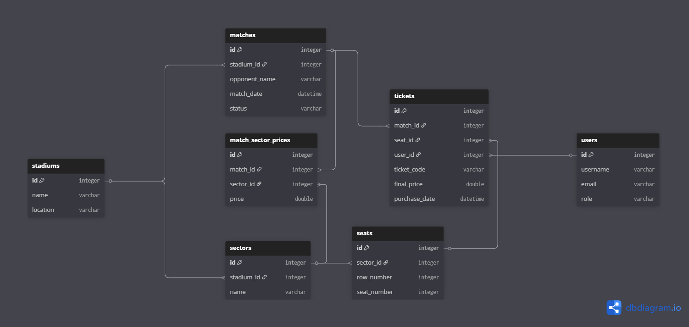

# Arena Ticketing Platform

Sistem backend pentru gestionarea vânzărilor de bilete la evenimente sportive, dezvoltat în Spring Boot. Acest proiect va fi continuarea unui proiect realizat în semestrul trecut tot în Spring Boot la care vom adăuga noi funcționalități cu scopul de a livra un produs finit, stabil și pregătit pentru utilizare reală.
Repository inițial: https://github.com/CaruntuRazvan/Arena-ticketing-backend

## Tehnologii și Framework-uri
* **Limbaj:** Java 21
* **Framework:** Spring Boot 3.x
* **Persistență:** Spring Data JPA / Hibernate
* **Bază de date:** H2 (In-memory)
* **Utilitare:** Lombok, ModelMapper, Spring Scheduler

## Arhitectură Sistem
Proiectul este structurat pe straturi (Layered Architecture):
* **Controller:** Expune endpoint-urile REST.
* **Service:** Conține logica de business și validările.
* **Repository:** Gestionează interacțiunea cu baza de date prin interfețe JPA.
* **Model (Entity):** Definește structura tabelelor și relațiile (1:N, M:N).

## Funcționalități Implementate
* **Gestiune Infrastructură:** Configurare stadioane, sectoare și locuri.
* **Ciclu de Viață Meci:** Gestionarea statusurilor meciurilor (Scheduled, Finished, Cancelled).
* **Pricing Dinamic:** Configurare prețuri diferențiate per sector pentru fiecare meci în parte
* **Logica de Ticketing:**
    * Achiziție bilete cu verificarea automată a disponibilității locului.
    * Validări de preț bazate pe configurația specifică Meci-Sector.
    * Achiziție Atomică: Suport pentru cumpărarea a până la 5 bilete într-o singură tranzacție
* **Politici de Securitate și Anti-Scalping:**
    * Limitare număr maxim de bilete per utilizator pentru un meci (configurabil).
    * Validare UUID: Generarea de coduri unice universale pentru fiecare bilet.
    * Control Acces (Check-in): Validarea biletelor la poarta stadionului (stare: UNUSED → USED) pentru a preveni refolosirea acestora.
* **Raportare și Monitorizare:**
    * Scheduled Tasks (Cron Jobs): Actualizarea automată a statusului meciurilor trecute în FINISHED zilnic la miezul nopții.
    * Reporting Admin: Calculul veniturilor totale și vizualizarea statisticilor de vânzare per eveniment.
## Structura Bazei de Date (ERD)
[TODO: Inserat aici noua diagramă]
Notă: Schema actuală extinde modelul din Semestrul 1 prin adăugarea tabelelor users și user_profiles, legate printr-o constrângere de cheie primară partajată.

## Ghid de Utilizare API (Swagger)
După pornirea aplicației, documentația interactivă poate fi accesată la: http://localhost:8080/swagger-ui.html